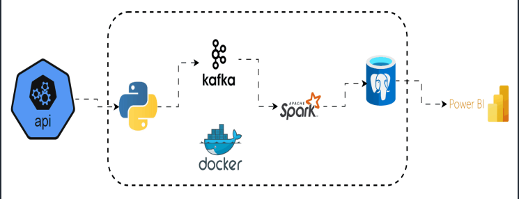

# Project1-StockMarket (Real-Time Big Data Project)

The project implements a **real-time data pipeline** that extracts stock data from vantage API, streams it through Apache Kafka, processes it with Apache Spark, and loads it into a **postgres** database. All components are containerized with Docker for easy deployment.




## Project Structure – Stock Market Real-Time Pipeline

```bash
Project1-StockMarket/
├── docker-compose.yml         # Orchestrates API, Kafka, Spark, Postgres, pgAdmin, and Kafka UI
├── .env                       # Environment variables (ports, credentials, API keys)
├── README.md                  # Setup + run instructions, versions, passwords, and port mappings

├── spark/
│   ├── consumer.py            # Spark job consuming Kafka streams and writing to Postgres
│   └── Dockerfile             # Spark container configuration for job execution

├── api/
│   ├── Dockerfile
│   ├── producer.py            # Kafka producer fetching live stock data via Alpha Vantage API
│   └── requirements.txt       # Python dependencies for producer service

├── db_init/
│   └── schema_tables.sql      # PostgreSQL schema definitions and table creation scripts

├── pgadmin/
│   └── servers.json           # pgAdmin server connection configuration

└── notebooks/                 # For ad-hoc data exploration and reporting
    └── stock_market_analysis.pbix  # Power BI dashboard file

```

## Project Tech Stack and Flow

- Kafka UI → inspect topics/messages.
- API → produces JSON events into Kafka.
- Spark → consumes from Kafka, writes to Postgres.
- Postgres → stores results for analytics.
- pgAdmin → manage Postgres visually.
- Power BI → external (connects to Postgres at localhost:5434).

## Run Container

```bash
docker compose down
docker compose build
docker compose up -d
docker compose ps

# only if you want a clean first-boot init
docker compose down -v
docker compose build
docker compose up -d
docker compose ps
```

- reclaim disk space in docker:

```bash
 docker system prune -af --volumes / docker builder prune -af
```

### Output

- Kafka UI → http://localhost:8082  
- Postgres → localhost:5434 (db market-pulse)
- pgAdmin → http://localhost:5050  (add server host postgres, user/pass admin/admin). add a server 
- Spark live UI shows at http://localhost:8080 (master) & http://localhost:8081 (worker)

## check opened ports

```bash
    docker compose ps
    docker compose port postgres 5432
## Tail logs
    docker compose logs -f api
    docker compose logs -f kafka
    docker compose logs -f spark

## Restart a single service after edits
    docker compose up -d --build api
    docker compose restart spark
```

## Validate compose file:

```bash 
docker compose config
```

## Confirm Spark has the Kafka & Postgres jars:

```bash
 docker compose exec spark bash -lc 'ls /opt/bitnami/spark/jars | egrep "kafka|postgresql"'
```

### API says queued but no Kafka messages: Check KAFKA_BOOTSTRAP is kafka:9092 inside the API container and that topic is events

## Power BI

Connect to PostgreSQL:

```bash
        Server: localhost:5434
        Database: market_pulse
        Credentials: user- admin, password- admin
```